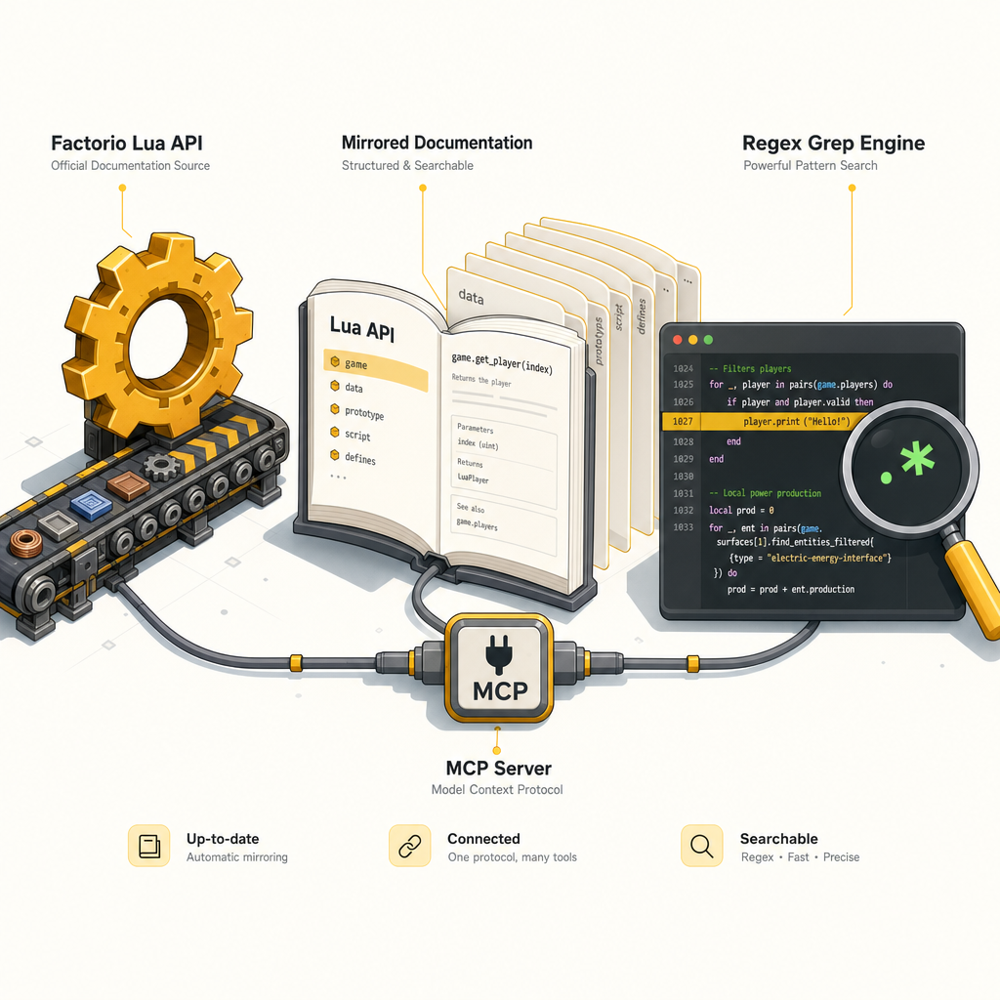

# factorio-docs-mcp

An MCP server that lively mirrors the **Factorio Lua API** documentation at
`https://lua-api.factorio.com/latest/` and exposes a regex grep engine over it.

Use it to answer questions like *"which LuaSurface method creates an entity at
a given tile?"*, *"what events fire when a robot completes a task?"*, or
*"what's in the `serpent` library?"* — without tab-hopping through HTML.

## What it does

1. **Lazy, cache-backed download** of the machine-readable JSON Factorio
   publishes alongside the docs:
   - `runtime-api.json` (~1.8 MB, 148 classes · 219 events · 418 concepts · 60 define trees)
   - `prototype-api.json` (~1.7 MB, 278 prototypes · 686 types)
   - plus the auxiliary HTML pages (`libraries`, `data-lifecycle`,
     `mod-structure`, `migrations`, …) since those aren't in JSON.
2. Flattens every class, event, concept, define, method, attribute,
   operator, prototype, type, property and auxiliary page into a single
   searchable list, each record carrying a deep-link back to the official
   page.
3. Serves them over MCP stdio with regex search + detail lookup.

Cache lives at `$XDG_CACHE_HOME/factorio-docs-mcp/` (or
`~/.cache/factorio-docs-mcp/`) and uses ETag / Last-Modified conditional
GETs, so refreshing is usually a ~1 KB 304 round trip.

## Install

```bash
cd factorio-docs-mcp
uv venv
source .venv/bin/activate
uv pip install -e .
```

## Run

```bash
factorio-docs-mcp            # stdio server
# or
python -m factorio_docs_mcp
```

Env vars:

| var | default | purpose |
| --- | --- | --- |
| `FACTORIO_DOCS_BASE_URL` | `https://lua-api.factorio.com/latest/` | Pin to a specific version, e.g. `.../2.0.76/` |
| `FACTORIO_DOCS_CACHE_DIR` | `$XDG_CACHE_HOME/factorio-docs-mcp` | Override cache location |
| `FACTORIO_DOCS_TTL_SECONDS` | `86400` | Skip remote check if cache younger than this |
| `FACTORIO_DOCS_LOG_LEVEL` | `INFO` | `DEBUG`/`INFO`/`WARNING` |

## Claude Code / Desktop config

Add to `~/.claude.json` (or Claude Desktop's `claude_desktop_config.json`):

```json
{
  "mcpServers": {
    "factorio-docs": {
      "command": "/ABS/PATH/factorio-docs-mcp/.venv/bin/factorio-docs-mcp"
    }
  }
}
```

Or, without installing:

```json
{
  "mcpServers": {
    "factorio-docs": {
      "command": "uv",
      "args": ["run", "--directory", "/ABS/PATH/factorio-docs-mcp", "python", "-m", "factorio_docs_mcp"]
    }
  }
}
```

## Tools

All tools return pretty-printed JSON strings.

### `search(pattern, kinds?, stages?, field?, case_sensitive?, limit?)`

Grep with a Python regex (`re.search`). Returns a list of summary records.

```
search("create_entity", kinds=["method"])
search("^on_player_", kinds=["event"])
search("speed", field="name", kinds=["attribute"], limit=20)
search("serpent", stages=["auxiliary"])
```

### `get(name)`

Return the full JSON record for a fully-qualified name:

```
get("LuaSurface")
get("LuaSurface.create_entity")
get("on_tick")
get("defines.alert_type")
get("defines.alert_type.entity_destroyed")
get("ContainerPrototype")
get("BoundingBox")
```

### `list_entries(kind?, stage?, pattern?, limit?)`

List fully-qualified names, optionally filtered.

### `auxiliary(page, max_chars?)`

Return the extracted text of an auxiliary page:

```
auxiliary("libraries")
auxiliary("data-lifecycle")
```

### `refresh()` / `stats()` / `cache_info()`

Force re-download · index counts + upstream version · per-file cache
metadata.

## How it maps names to URLs

| Record kind | URL shape |
| --- | --- |
| `class` | `classes/<Name>.html` |
| `method` / `attribute` / `operator` | `classes/<Class>.html#<Class>.<member>` |
| `event` | `events.html#<event_name>` |
| `concept` | `concepts/<Name>.html` |
| `define` | `defines.html#defines.<dotted.path>` |
| `prototype` | `prototypes/<Name>.html` |
| `property` | `prototypes/<Parent>.html#<name>` |
| `type` | `types/<Name>.html` |
| `auxiliary` | `auxiliary/<slug>.html` |

## Why this shape

- First-principles: the Factorio docs site has **no server-side search
  endpoint**. It does publish the canonical JSON machine-readable export
  (that's what the IDE autocomplete tools consume). Grep over the JSON is
  the lowest-cost way to get high-signal answers.
- Lazy-on-first-call + ETag conditional GETs keep steady-state traffic at
  ~1 KB per source.
- Flat records with pre-computed `search_blob` make every grep O(N) over
  ~5-10 k short strings — trivial on the main thread, no index rebuild
  needed.
